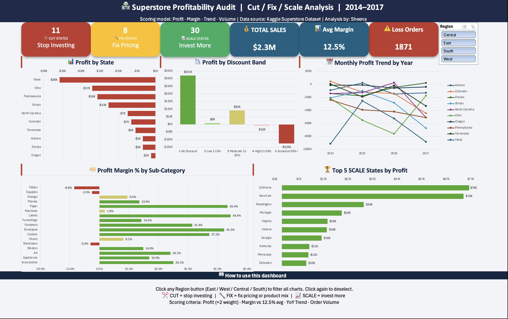
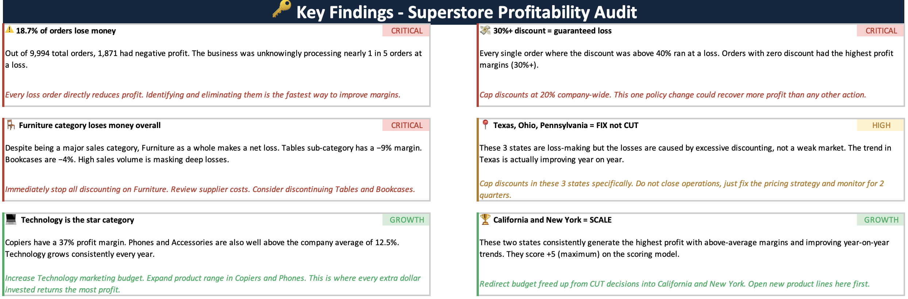
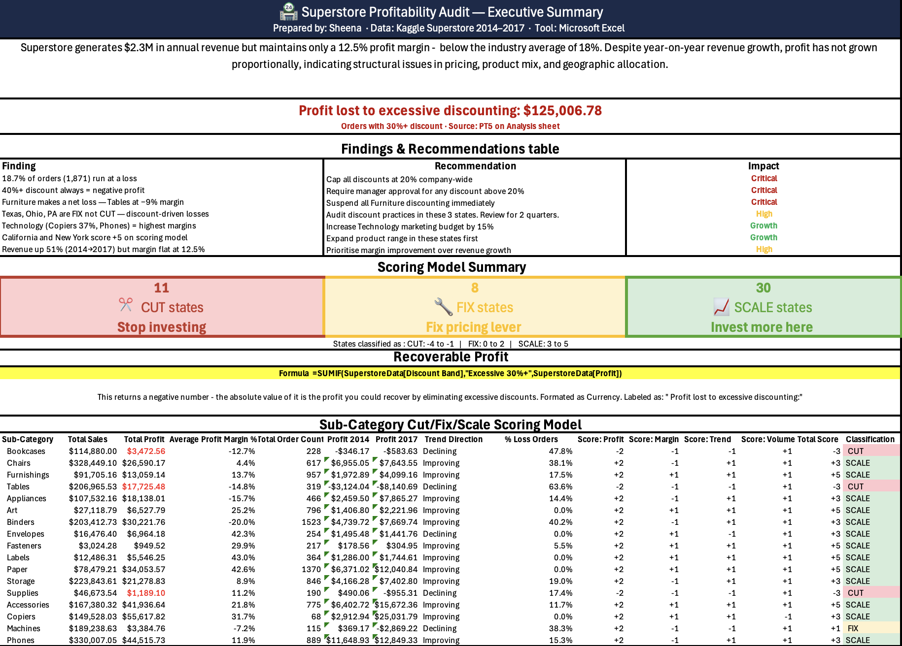
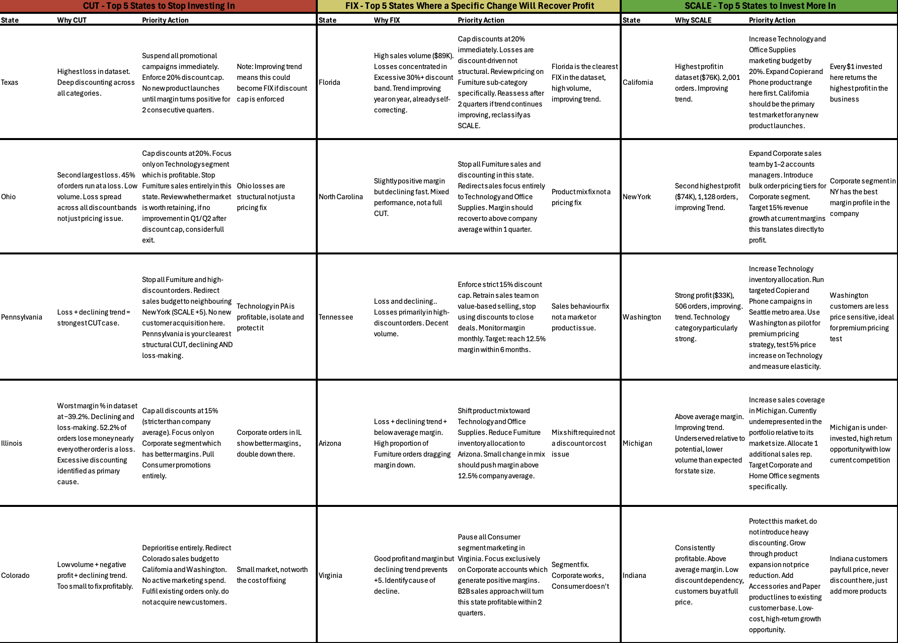
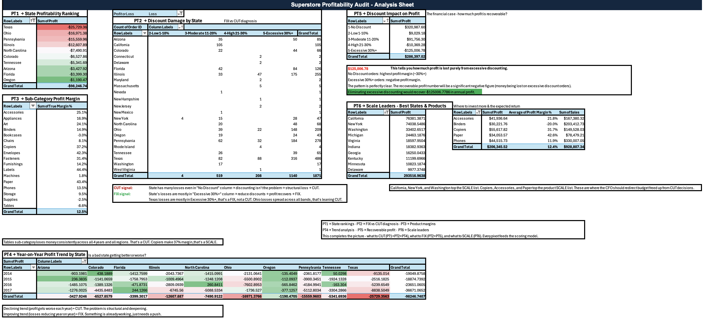

# 🏪 Superstore Profitability Audit | Cut / Fix / Scale Analysis

**Prepared by: Sheena** | Data: Kaggle Superstore Dataset (2014–2017) | Tool: Microsoft Excel

---

## 📊 Dashboard Preview



---

## 🎯 Project Summary

A full end-to-end profitability audit of a US retail superstore using **9,994 orders across 49 states and 17 sub-categories (2014–2017)**.

The project builds a **custom 4-criteria scoring model** that classifies every state and sub-category as:

| Classification | Criteria | Action |
|---|---|---|
| ✂️ **CUT** (score < 0) | Loss-making, below-average margin | Stop investing |
| 🔧 **FIX** (score 0–2) | Profitable but declining trend | Fix pricing or product mix |
| 📈 **SCALE** (score 3–5) | Profitable, above-average margin, improving | Invest more here |

**Scoring model:** Profit (×2 weight) · Margin vs 12.5% avg · YoY Trend · Order Volume

---

## 💡 Key Findings

| # | Finding | Priority |
|---|---|---|
| 1 | 18.7% of orders (1,871 of 9,994) run at a loss | 🔴 Critical |
| 2 | Every order with 40%+ discount generates negative profit — no exceptions | 🔴 Critical |
| 3 | Furniture category makes a net loss — Tables at −9% margin, Bookcases at −3% | 🔴 Critical |
| 4 | Texas, Ohio, PA are FIX not CUT — losses are discount-driven, not structural | 🟡 High |
| 5 | Technology is the star category — Copiers at 37%, Phones above average | 🟢 Growth |
| 6 | California and New York score +5 (maximum) on the scoring model | 🟢 Growth |

### 💸 Headline Number
> **$125,006.78** in profit lost to excessive discounting (40%+ discount band)
> This is recoverable in Year 1 by capping all discounts at 20% company-wide.

---

## 📈 Scoring Model Results

| Category | Count | States |
|---|---|---|
| ✂️ CUT | 11 states | Texas, Ohio, Pennsylvania, Illinois, North Carolina, Colorado, Tennessee, Arizona, Florida, Oregon, Wyoming |
| 🔧 FIX | 8 states | Maine, South Carolina, Utah, Arkansas, Alabama, Rhode Island, Wisconsin, Kentucky |
| 📈 SCALE | 30 states | California, New York, Washington, Michigan, Indiana, Georgia, Maryland, New Jersey, Virginia + more |

---

## 🖼️ Project Screenshots

### 🔑 Key Findings Sheet


### 📋 Executive Summary


### 🧮 Scoring Model — Cut / Fix / Scale by State


### 📊 Analysis Sheet — 6 Pivot Tables


---

## 🗂️ Workbook Structure

| Sheet | Contents |
|---|---|
| 📁 Raw Data | Original dataset — locked and protected |
| 🧹 Clean Data | Cleaned data + 7 engineered helper columns |
| 📊 Analysis | 6 pivot tables feeding the scoring model and dashboard |
| 🧮 Scoring Model | CFS classification for all 49 states and 17 sub-categories |
| 📺 Dashboard | Interactive one-page dashboard with Region slicer |
| 📋 Exec Summary | Board-ready findings, recommendations, and CFS summary |

---

## 🧹 Data Cleaning & Engineering

**Dataset:** 9,994 rows × 21 columns | Source: [Kaggle Superstore Dataset](https://www.kaggle.com/datasets/vivek468/superstore-dataset-final)

**Cleaning steps:**
- Removed duplicates (0 found), fixed date formats, formatted currency and percentage columns
- Deleted irrelevant columns: Row ID, Country, Product ID
- Converted to named Excel Table: `SuperstoreData`

**7 Engineered Helper Columns:**

| Column | Formula |
|---|---|
| Year | `=YEAR([@[Order Date]])` |
| Month | `=TEXT([@[Order Date]],"MMM")` |
| Profit Margin % | `=IFERROR([@Profit]/[@Sales],0)` |
| Days to Ship | `=[@[Ship Date]]-[@[Order Date]]` |
| Profit or Loss | `=IF([@Profit]>0,"Profit","Loss")` |
| Discount Band | `=IFS([@Discount]=0,"1-No Discount", [@Discount]<=0.1,"2-Low 1-10%", [@Discount]<=0.2,"3-Moderate 11-20%", [@Discount]<=0.3,"4-High 21-30%", [@Discount]>0.3,"5-Excessive 30%+")` |
| Profit per Unit | `=IFERROR([@Profit]/[@Quantity],0)` |

---

## 🧮 Scoring Model — Formula Logic

```excel
Score: Profit  = IF(TotalProfit > 0, +2, -2)
Score: Margin  = IF(AvgMargin > 12.5%, +1, -1)
Score: Trend   = IF(Profit2017 > Profit2014, +1, -1)
Score: Volume  = IF(OrderCount >= 100, +1, -1)

Total Score    = Sum of all 4 scores  (range: -5 to +5)
Classification = IF(Score>=3, "SCALE", IF(Score>=0, "FIX", "CUT"))
```

**Key formulas used:**
```excel
=SUMIF(SuperstoreData[State], A5, SuperstoreData[Profit])
=SUMPRODUCT((SuperstoreData[State]=A5)*(SuperstoreData[Year]=2017)*SuperstoreData[Profit])
=COUNTIFS(SuperstoreData[State],A5, SuperstoreData[Profit or Loss],"Loss") / COUNTIF(SuperstoreData[State],A5)
=SUMIF(SuperstoreData[Discount Band],"5-Excessive 30%+", SuperstoreData[Profit])
```

---

## 📺 Dashboard Features

- **5 interactive charts** — State Profit Ranking · Discount vs Profit · Sub-Category Margins · YoY Trend · Top SCALE States
- **Region Slicer** — click East / West / Central / South to filter all 5 charts simultaneously
- **6 KPI cards** — CUT/FIX/SCALE counts + Total Sales ($2.3M) + Avg Margin (12.5%) + Loss Orders (1,871)
- **Conditional formatting** — full row colouring on scoring model (red/amber/green)

---

## 🛠️ Tools & Skills Used

`Microsoft Excel` `Pivot Tables` `SUMPRODUCT` `SUMIF` `COUNTIFS` `IFS` `IFERROR` `Conditional Formatting` `Data Validation` `Pivot Charts` `Slicers` `Data Cleaning` `Business Intelligence` `Scoring Model Design`

---

## 📁 Files in This Repository

| File | Description |
|---|---|
| `Superstore_Profitability_Audit.xlsx` | Full Excel workbook — 6 sheets, 9,994 rows, scoring model, dashboard |
| `dashboard-preview.png` | Dashboard screenshot |
| `key-findings.png` | Key Findings sheet screenshot |
| `exec-summary.png` | Executive Summary screenshot |
| `scoring-model.png` | Scoring Model screenshot |
| `analysis-sheet.png` | Analysis Sheet screenshot |

---

## 🚀 How to Use

1. Download `Superstore_Profitability_Audit.xlsx`
2. Open in Microsoft Excel (365 recommended)
3. Go to the **📺 Dashboard** sheet
4. Click any **Region button** (East / West / Central / South) to filter all charts
5. Go to **🧮 Scoring Model** to see the full state-by-state classification
6. Go to **📋 Exec Summary** for board-ready findings and recommendations

---

## 👩‍💻 About

**Sheena** — Data Analytics Portfolio Project

📧 [LinkedIn](https://www.linkedin.com/in/sheena-charaya/)

---

*Data source: [Kaggle Superstore Dataset by Vivek468](https://www.kaggle.com/datasets/vivek468/superstore-dataset-final)*
